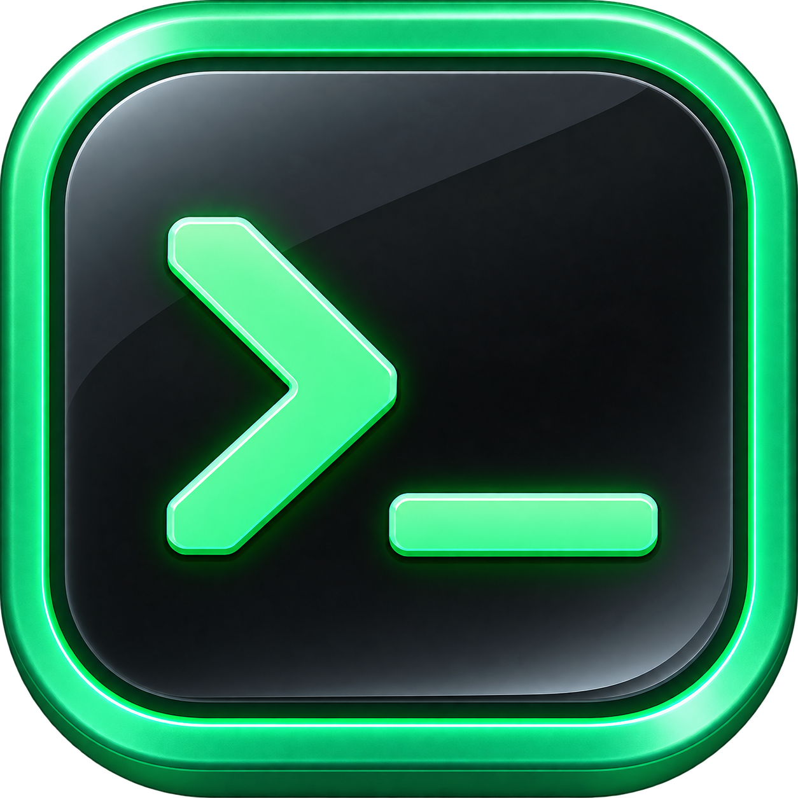
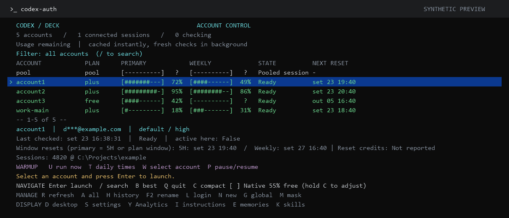
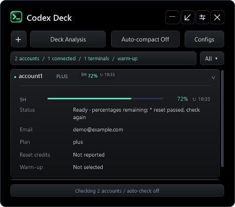

<p align="center">
  
</p>
<h1 align="center">Codex Deck</h1>
<p align="center"><strong>One command. Every account. A clear view of your usage.</strong><br>
A terminal dashboard and desktop companion for multiple Codex CLI accounts on Windows.</p>
<p align="center">
  <a href="https://github.com/xtremexq/CodexDeck/actions/workflows/test.yml"></a>
  
  <a href="LICENSE"></a>
</p>
<p align="center"><a href="#install">Install</a> · <a href="#terminal-dashboard">Terminal</a> · <a href="#desktop-companion">Desktop</a> · <a href="#commands">Commands</a> · <a href="#help">Help</a></p>

<p align="center"></p>

## Your accounts, together

Run **`codex-auth`** to see your local accounts and their cached usage immediately. Check fresh limits in the background, find the profile you need, and launch Codex from the same terminal. Keep the floating desktop widget nearby when you want usage visible while you work.

| Terminal dashboard | Desktop companion |
| --- | --- |
| Search and navigate accounts with the keyboard | Switch between a control panel and floating widget |
| See quota bars, plans, reset times and attached sessions | Keep usage nearby with tray access and optional always-on-top |
| Refresh one account or queue every account | Run manual checks or enable automatic polling |
| Launch Codex, log in, or create a profile | Choose a launch folder and customize visible details |
| Print a cached snapshot for scripts | Configure optional, quota-consuming warm-up requests |

## Less account juggling. More time to build.

Codex Deck brings your accounts, usage limits, and sessions into one view so you can get back to building.

**If Deck saves you time, help keep it moving forward.**

Your support funds bug fixes, testing, and improvements that make Deck easier to use every day.

**[Support Codex Deck →](https://xtremexq.github.io/CodexDeck/support/)** · Give once or monthly through GitHub Sponsors.

Always optional; Deck is free and open source.

## Install

**Requires Windows, Windows PowerShell 5.1, and Codex CLI available as `codex`.** The desktop companion uses WPF and the Windows system tray. Linux and macOS are not supported. No administrator account is required.

Download **[CodexDeck-1.3.0.zip](https://github.com/xtremexq/CodexDeck/releases/download/1.3.0/CodexDeck-1.3.0.zip)** from [the latest release](https://github.com/xtremexq/CodexDeck/releases/latest), extract it, then run the installer in that folder:

```powershell
powershell.exe -NoProfile -ExecutionPolicy Bypass -File .\Install-CodexDeck.ps1
```

Or install from source:

```powershell
git clone https://github.com/xtremexq/CodexDeck.git
cd CodexDeck
powershell.exe -NoProfile -ExecutionPolicy Bypass -File .\Install-CodexDeck.ps1
```

The [main-branch ZIP](https://github.com/xtremexq/CodexDeck/archive/refs/heads/main.zip) also works with the same installer. Release assets include a SHA-256 checksum.

Open a **new terminal** and run:

```powershell
codex-auth
```

Press **N** to create a profile and sign in. Already have local profiles under `.codex-loop/accounts`? They appear automatically. You can also create or open one directly with `codex-auth account1`.

The installer adds command wrappers to your user PATH and preserves existing account data. Codex CLI is installed separately. The execution-policy flag applies only to the installer process.

## Terminal dashboard

### A few keys cover the everyday work

| Key | Action |
| --- | --- |
| **↑ / ↓** | Select an account |
| **Page Up / Page Down**, **Home / End** | Navigate a longer list |
| **Enter** | Launch Codex; return to the dashboard when it exits |
| **R** | Refresh the selected account |
| **A** | Queue fresh checks for every account |
| **/** | Search account names |
| **L** | Log in to the selected account |
| **N** | Create a new profile and log in |
| **D** | Open the desktop companion |
| **M** | Toggle email masking; masking starts enabled |
| **Esc** | Clear the search, or quit when no search is active |
| **Q** | Quit the dashboard |

Cached usage appears first. Authenticated accounts with missing or more-than-five-minute-old results are checked automatically, with up to three checks running at once. The panel stays responsive while checks run. Opening it does not send a warm-up prompt.

**Bars show quota remaining.** Primary is the five-hour window, or another plan-specific window such as a free account's longer allowance. Weekly is shown separately when available. `?` means the value is unknown; it does not mean zero. Reset timestamps use your local time. **Reset passed** means the displayed value needs a fresh check.

The selected account's details show its model, reasoning effort, last check and attached terminal sessions. A connected session means a terminal launched through `codex-auth`; it does not necessarily mean Codex is generating a response.

For a non-interactive view, use **`codex-auth status`**. It prints cached data without network requests. Redirecting the bare command's input or output also selects snapshot mode.

## Desktop companion

<p align="center"></p>

Run **`codex-deck`**, or press **D** in the terminal dashboard.

- **Open Terminal** launches the selected account in your default or chosen folder.
- Click the **online / terminals** bar to switch between connected accounts and all profiles, in either view.
- Click the status bar below the list to check every visible account.
- Switch between the **panel** and **widget**, then expand account rows for more detail.
- **Settings** controls appearance, visible fields, email masking, automatic checks and warm-up.
- The panel appears in the taskbar; the widget and Settings stay out of it. Use **Minimize** to minimize the panel.
- Closing the window normally hides it to the tray. **Quit** stops Deck's monitoring without closing your Codex terminals.

Desktop automatic checks are off by default. Enable them in Settings if you want continued polling. Terminal startup checks and desktop polling are separate controls.

### Optional warm-up

Warm-up is off by default and requires eligible account selection. It runs independently of ordinary automatic checks and connected terminals, while Deck remains open or in the tray. After observing an eligible paid account's five-hour reset and verifying fresh zero usage, Deck can send a small prompt after a grace period. It skips unsupported plans, unavailable quotas and missed reset windows, and records attempts to avoid repeats.

In the terminal dashboard, **W** toggles the selected account and **P** pauses or resumes all warm-ups. The shared tray scheduler continues after the dashboard closes. In the GUI, right-click an account for the same controls or use Settings for all paid accounts, model and reset timing. Expanded account details and the terminal show the next check or why warm-up is waiting. Quit Deck from the tray to stop scheduling.

**Warm-up consumes real quota.** A successful prompt does not guarantee that a new usage timer starts. Leave it disabled if you only want monitoring.

## Commands

```powershell
codex-auth                       # Interactive terminal dashboard
codex-auth status                # Cached snapshot; no network
codex-auth list                  # List local profiles
codex-auth account1              # Launch an account
codex-auth 2                     # Shorthand for account2
codex-auth work-main             # Use a named profile
codex-auth account1 login        # Sign in to that profile
codex-auth account1 login status # Ask Codex for login status
codex-auth account1 -del         # Move an inactive profile to recovery
codex-deck                       # Open the desktop companion
codex-check                      # Fetch a usage report
codex-check -Account account1    # Check one account
codex-check -Json                # Machine-readable usage report
codex-check -NoColor             # Plain-text usage report
```

Each profile has a separate `CODEX_HOME`. New profiles can inherit local configuration, rules and skills; authentication remains separate. Deletion keeps a recovery copy and refuses an account with a tracked connected terminal.

## Local data and privacy

Deck has no hosted backend. Usage checks use local Codex authentication to contact upstream services, with a Codex app-server fallback. These integrations depend on the installed CLI and upstream behavior.

Paths below are relative to your Windows user profile:

| Path | What lives there |
| --- | --- |
| `.codex-loop/accounts/` | Per-account sign-ins, configuration and Codex data |
| `.codex-loop/deleted-accounts/` | Recoverable removed profiles |
| `.codex-loop/deck/` | Preferences, usage caches, session records and warm-up history |
| `.local/bin/` | Installed command wrappers |

Email masking affects the display, not the saved cache. Recovery copies can contain sign-ins. Keep live installation data and account exports out of GitHub; see [SECURITY.md](SECURITY.md).

## Update or remove

To update a Git installation:

```powershell
git pull --ff-only
powershell.exe -NoProfile -ExecutionPolicy Bypass -File .\Install-CodexDeck.ps1
```

Close the terminal dashboard and quit desktop Deck before updating, then reopen them afterward. The installer preserves account/state directories, backs up replaced files and skips unchanged payloads.

To remove Deck, quit it and remove its installed scripts and command wrappers. Keep `.codex-loop/accounts` if you want to retain your profiles and history. Only remove `.local/bin` from PATH if no other tools use it. There is no automatic account-data deletion during uninstall.

## Help

| Problem | Try this |
| --- | --- |
| `codex-auth` is not found | Open a new terminal; check that `.local/bin` is on your user PATH |
| `codex` is not found | Install Codex CLI separately and confirm `codex --version` works |
| The dashboard only prints once | Run it in an interactive terminal without input/output redirection |
| No profiles appear | Press **N**, or run `codex-auth account1`; clear any search filter |
| Usage is old or unavailable | Press **R**; check `codex-auth account1 login status` and `codex-check -Account account1` |
| The desktop window disappeared | Check the tray overflow or run `codex-deck` |
| Automatic desktop checks are idle | Enable them in Settings and check which profiles are visible |

[Report a bug](https://github.com/xtremexq/CodexDeck/issues) with the command, expected behavior and sanitized error output. Do not attach live account files.

## For contributors

Source is in `suite/`; command wrappers are in `bin/`. Run `Test-Repository.ps1` before contributing to check script syntax, encoding, and repository hygiene.

See [CONTRIBUTING.md](CONTRIBUTING.md) for checks and screenshot generation, [CHANGELOG.md](CHANGELOG.md) for release history, and [LICENSE](LICENSE) for the MIT license.

### Account tools

Best-account selection, local session history, account rename, manual reset-credit details, and opt-in live failover are documented in [Account tools](docs/ACCOUNT-TOOLS.md).

## Disclaimer

Codex Deck is an independent project, not affiliated with or endorsed by OpenAI. Codex and other product names belong to their respective owners. You need your own Codex CLI installation and accounts; Deck does not provide quota or change account limits. Usage information may be delayed or unavailable. The software is provided “as is,” without warranty, under the [MIT license](LICENSE).
