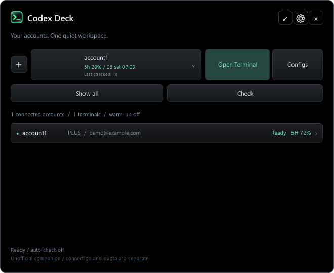

<p align="center">
  
</p>

<h1 align="center">Codex Deck</h1>

<p align="center">
  <b>Your accounts. Your usage. One small deck.</b><br>
  A local Windows companion for people who work with multiple Codex CLI accounts.
</p>

<p align="center">
  <a href="https://github.com/xtremexq/CodexDeck/releases/latest"></a>
  
  
  <a href="LICENSE"></a>
  <a href="https://github.com/xtremexq/CodexDeck/actions/workflows/test.yml"></a>
</p>

<p align="center">
  <a href="#quick-start">Quick start</a> ·
  <a href="#at-a-glance">Features</a> ·
  <a href="#usage-warmup">Usage Warmup</a> ·
  <a href="#privacy-and-local-data">Privacy</a> ·
  <a href="#troubleshooting">Help</a>
</p>

---

<p align="center"><br><sub>Synthetic preview. No real account data.</sub></p>

## At a glance

| Accounts & terminals | Usage & visibility |
| :--- | :--- |
| Separate local Codex profiles | Check visible accounts with one button |
| Named accounts from the **+** button | Optional automatic checks for connected accounts |
| Launch in a default folder or choose each time | Usage percentages, reset times, and cached status |
| Edit account config and global defaults | Optional usage details in the account picker |

| Your desktop | Your preferences |
| :--- | :--- |
| Black panel with expandable account rows | Settings grouped into four tabs |
| Small floating widget and tray access | Compact rows start collapsed |
| Independent panel and widget sizing | Email masking and detail visibility controls |
| Closing Deck leaves account terminals running | Always on top, automatic checks, and warmup start off |

This is an unofficial project, independent of OpenAI. It does not provide accounts, extra quota, or a Codex subscription.

## Quick start

**Requirements:** Windows with Windows PowerShell 5.1, a desktop session, and Codex CLI installed and available as `codex`. WPF and Windows tray integration mean this version does **not** run on Linux or macOS. The installer does not install Codex or require an administrator account.

1. Download **CodexDeck-1.0.0.zip** from [Releases](https://github.com/xtremexq/CodexDeck/releases/latest) and extract it.
2. Open PowerShell in the extracted folder and run:

   ```powershell
   powershell.exe -NoProfile -ExecutionPolicy Bypass -File .\Install-CodexDeck.ps1
   ```

3. Open a **new terminal**, then start your first profile:

   ```powershell
   codex-auth account1
   ```

4. Follow Codex's sign-in flow. Open `codex-deck` to manage profiles and use **Check** to fetch usage.

The installer copies scripts and icons into `%USERPROFILE%\.codex-loop` and command wrappers into `%USERPROFILE%\.local\bin`, adding the latter to your user PATH. Source archives from GitHub work with the same installer. Scripts are unsigned; review them before running. Execution policy bypass above applies to that process only.

## Everyday controls

| Control | What it does |
| :--- | :--- |
| **+** | Create a named profile; a numbered account name is suggested |
| Account picker + **Open terminal** | Launch the selected profile in your chosen folder |
| **Configs → Account config** | Edit the selected account's TOML configuration |
| **Configs → Defaults** | Edit global defaults used to seed new profiles |
| **Show all** | Include disconnected local profiles in the panel |
| **Check** | Queue checks for visible accounts, including disconnected ones when Show all is active |
| Row arrow | Expand account details; the widget grows within available screen space |
| View switch | Move between the panel and floating widget |
| Close / tray menu | Hide, restore, open settings, or quit Deck |

Global defaults are not a second config for the selected account. Existing account choices are preserved; config changes apply on the next launch. The editor makes backups and detects conflicts, but does not validate TOML syntax.

Closing the window hides Deck to the tray by default. **Quit** exits monitoring and stops pending warmup work; it does not close account terminals. Tray icons may appear in Windows' notification overflow. Connection indicators track terminals launched through `codex-auth`, not whether Codex is actively generating.

### Command reference

```powershell
codex-deck                       # Open or reveal Deck
codex-auth account1              # Launch an isolated profile
codex-auth work-main             # Custom profile name
codex-auth list                  # List local profiles
codex-auth account1 -del         # Archive an inactive profile for recovery
codex-check                      # Usage report
codex-check -Account account1    # Check one account
codex-check -Json                # Machine-readable output
codex-check -NoColor             # Plain output
```

New profiles can inherit config, rules, and skills from an existing local profile. Authentication is separate. Account instructions use a shared `accounts/AGENTS.shared.md` file linked into profiles.

## Settings and checks

| Tab | Options |
| :--- | :--- |
| **Appearance** | View mode, compact rows, always on top, close-to-tray, start with account terminals, opacity, default folder, always ask for folder |
| **Details** | Email, plan, quota, resets, optional diagnostics, email masking, widget details, account-picker usage |
| **Checks** | Enable automatic checks, polling interval, minimum request spacing |
| **Usage Warmup** | Enable warmup, select accounts and model, tune reset grace and maximum delay |

Email, plan, quota, and reset details start enabled for the panel. Account-picker usage is optional: it shows colored **percentage used / next local reset** and a gray relative last-check age. Deck displays the windows returned by the account, including five-hour, weekly, or monthly windows when present; it does not fabricate missing limits from the plan name.

Automatic checks start **disabled**. When enabled, only connected accounts are polled, normally every ten minutes. Requests are serialized with a default twenty-second gap. Minimum settings are five minutes between regular account checks and fifteen seconds between requests. Manual checks respect spacing and a one-minute account cooldown. Failures back off; cached data is labeled. **Show all** changes visibility, not automatic polling scope.

## Usage Warmup

Warmup is **off by default** and requires explicit account selection and confirmation. The default model is `gpt-5.6-luna` with low reasoning effort; the selector loads available models through Codex and caches the list. Availability depends on the installed CLI and account.

For a connected eligible paid account, Deck can observe a five-hour reset, verify fresh zero usage after a grace period, and send a tiny non-interactive prompt. Automatic checks must also be enabled. Free, Go, unknown plans, exhausted or unknown quota, already-used windows, and missed events outside the configured delay are skipped.

Attempts are persisted before execution, limited to one per observed reset, with a four-hour account cooldown and no automatic retry. The request uses an empty working directory, ephemeral execution, a read-only sandbox, and no approvals. **This consumes real quota. A successful prompt does not guarantee that a new usage timer starts.**

## Privacy and local data

Deck has no hosted backend. Usage checks contact OpenAI services using local Codex authentication, with a CLI app-server fallback. These integrations can change upstream.

| Local location | Contents |
| :--- | :--- |
| `.codex-loop/accounts` | Credentials, account config, Codex sessions, rules, and skills |
| `.codex-loop/deleted-accounts` | Recovery archives, which can contain credentials |
| `.codex-loop/deck` | Settings, email/usage cache, session leases, and warmup outcomes |
| `.local/bin` | Command wrappers |

All paths are relative to your Windows user profile. Protect runtime data like credentials. Email masking is visual; it does not remove values from the local cache. Never upload a live installation directory. This repository and release include only source, tests, documentation, and app assets. See [SECURITY.md](SECURITY.md).

## Updating and removal

Deck starts with `codex-auth` when its autostart option is enabled; this is not Windows sign-in startup.

Quit Deck before rerunning a newer installer. Account terminals can stay open. The installer preserves account/state directories and backs up replaced source files alongside them; restart Deck afterward.

To remove the app, quit it and disable autostart in Settings first. Remove the four `codex-*` wrappers installed in `.local/bin` and the Deck source files from `.codex-loop`. Keep account directories if you want to retain credentials/history. Remove `.local/bin` from PATH only if no other tools use it. The installer deliberately has no automatic account-data deletion step.

## Troubleshooting

| Symptom | Check |
| :--- | :--- |
| Command not found after install | Open a new terminal; confirm `.local/bin` is on your user PATH |
| `codex` is missing | Install Codex CLI separately and verify `codex --version` |
| No account entries | Create a profile with `codex-auth account1`; use Show all for disconnected profiles |
| No fresh usage | Press Check and allow the queue to run; check authentication and error status |
| Auto-check appears idle | Enable it in Checks; only connected accounts are automatically checked |
| Window is gone | Look in the tray overflow, or run `codex-deck` to reveal it |
| Model list is unavailable | Verify CLI/account access; a cached/default model may remain visible |
| Linux or macOS startup fails | This WPF release is Windows-only; a UI port is required |

## Development

```powershell
powershell.exe -NoProfile -File .\suite\Test-Deck.ps1
powershell.exe -NoProfile -File .\suite\Test-DeckScheduler.ps1
powershell.exe -NoProfile -File .\suite\Test-CodexAuth.ps1
powershell.exe -NoProfile -File .\suite\Test-CodexLoopUsage.ps1
powershell.exe -NoProfile -STA -File .\suite\Codex-Deck.ps1 -SmokeTest
powershell.exe -NoProfile -STA -File .\suite\Codex-Deck.ps1 -LifecycleTest
```

Tests use synthetic data and temporary fixtures; smoke/lifecycle modes make no usage or warmup requests. `-Demo` opens a synthetic widget; add `-PreviewMode Panel` to preview the panel. Install the app for normal use: launching the source directly is not a portable installation.

The `suite/` directory contains WPF UI, theme, state/scheduler logic, usage adapter, and tests; `bin/` contains command wrappers. See [Contributing](CONTRIBUTING.md) and the [Changelog](CHANGELOG.md).

Run `./Test-Repository.ps1` for repository privacy/encoding checks. After committing, `./Build-Release.ps1 -Version 1.0.0` produces a source-only ZIP and SHA-256 checksum in `dist/` using `git archive`. No runtime directories are included. The project is distributed under the [MIT license](LICENSE); the app icon was created with AI assistance.

---

<p align="center"><b>Codex Deck</b><br><sub>A little less account juggling. A little more room to work.</sub><br><a href="https://github.com/xtremexq/CodexDeck/issues">Report a bug or suggest a feature</a></p>
